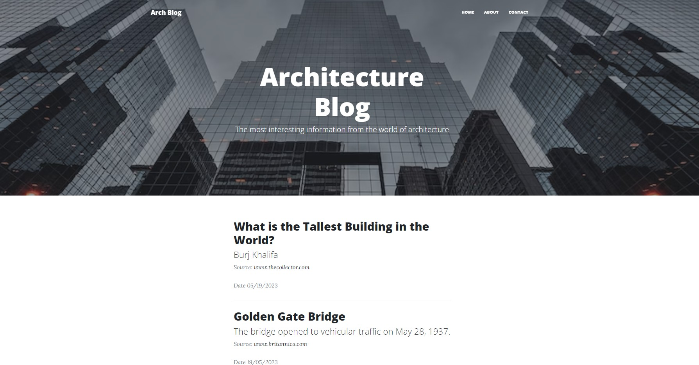
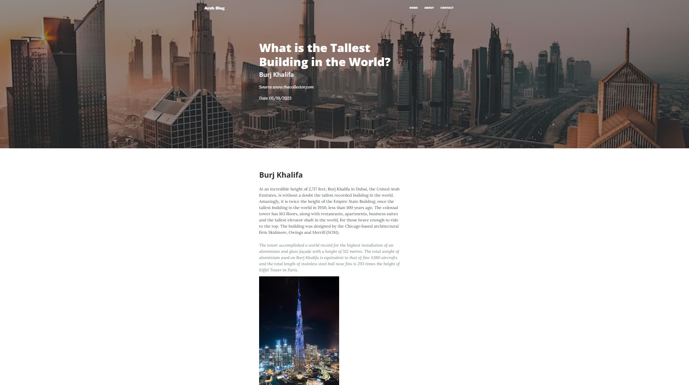
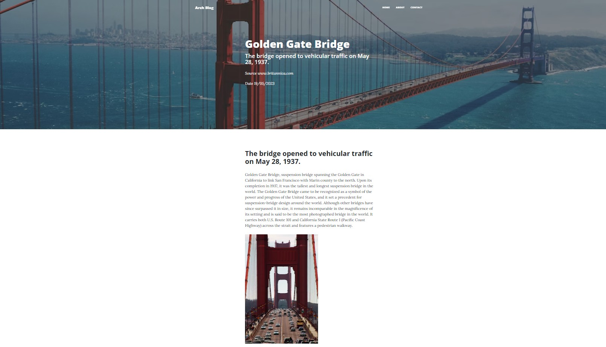
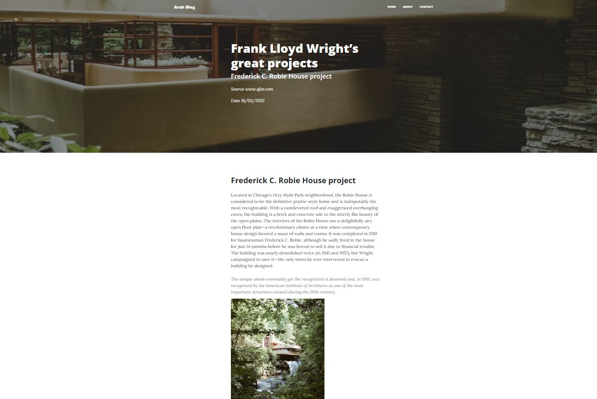
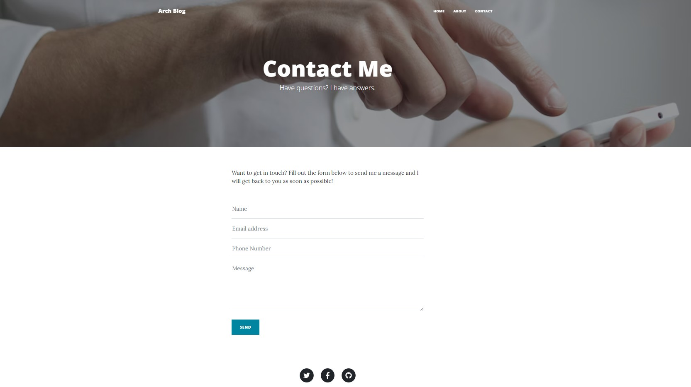

# Arch_info

Web app with information for architects. Now Users can choose post  and read more information. Moreover users can contact with sending me an email (use SMTP). In future I want to add 2 practical section  - information to create building available for disabled people and section to calculate fire protection for bulding segments.

## Table of Contents

* [General Info](#general-information)
* [Technologies Used](#technologies-used)
* [Features](#features)
* [Previews](#Previews)
* [Setup](#setup)
* [Project Status](#project-status)
* [Room for Improvement](#room-for-improvement)
* [Contact](#contact)
* [License](#license)

## General Information

This is Flask application to show useful information about architecture.

## Technologies Used

- Python - version 3.11
- Bootstrap - version 5.2.3
- Flask - version 2.2.2
- WTForms - version  3.0.1
- SMTP

## Features

List the ready features here:

- Home page showing list with posts,
- User can choose post and read more information,
- User can contact with me via email,

## Previews

### Home Page

### Single posts

### Contact Page

## Setup

- Clone This Project git clone
- Enter Project Directory cd Arch_info
- Create a Virtual Environment (for Windows) py -m venv (name your virtual enviroment :) venv

'EXAMPLE: py -m venv venv'

- Activate Virtual Environment source: venv/Scripts/activate
- Install Requirements Package pip install -r requirements.txt
- Finally Run The Project: python app.py

## Project Status

Project is: _in progress_

## Room for Improvement

Room for improvement:

- section for architect with practical information about fire protection,
- section for architect with practical information about architectural solutions for people with disabilities

To do:

- create forms to get informatin about building to get the rigth fire protection,
- create routes to calaculate fire load and choose right solutions,

## Contact

- Created by [@RockPiryt Github](https://github.com/RockPiryt)
- My Resume [@RockPiryt Resume](https://rockpiryt.github.io/Personal_Site/)

Feel free to contact me!

## License

This project is open source and available under the [MIT License]
